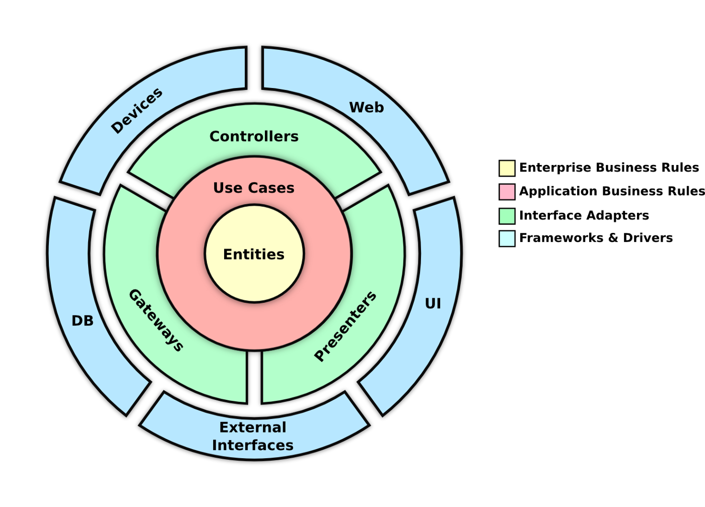

## Technical Details

### Techs tack used

The service is written in Java and uses:
* Spring Boot 3.2.0 as an underlying framework.
* [Liquibase](https://www.liquibase.org/)
* [Official Apache Maven documentation](https://maven.apache.org/guides/index.html) as build tool
* [Spring Web](https://docs.spring.io/spring-boot/docs/3.2.0/reference/htmlsingle/index.html#web)
* [Spring Data JPA](https://docs.spring.io/spring-boot/docs/3.2.0/reference/htmlsingle/index.html#data.sql.jpa-and-spring-data) to access and persist data between Java object/ class.
* [Liquibase Migration](https://docs.spring.io/spring-boot/docs/3.2.0/reference/htmlsingle/index.html#howto.data-initialization.migration-tool.liquibase) to manage database migrations.
* [Validation](https://docs.spring.io/spring-boot/docs/3.2.0/reference/htmlsingle/index.html#io.validation) for Bean validation.
* [Spring Boot Actuator](https://docs.spring.io/spring-boot/docs/3.2.0/reference/htmlsingle/index.html#actuator) to expose operational information.

### System requirements

In order to build and run this project, you need the following components:

- Java 17 (recommend [Eclipse Temurin 17](https://adoptium.net/temurin/releases/?version=17))
- Docker (or a compatible container runtime)

### Running the service with an IDE (i.e. IntelliJ IDEA)

Cloning the service and running it:
```sh
git clone https://github.com/randyhbh/todo-list.git

cd todo-list

./mvnw clean verify spring-boot:run
```

### Running the unit tests independently
```sh
./mvnw test
```

### Running the integration tests independently
```sh
./mvnw -DskipUnit=true verify
```

### Running the service with docker. Make sure docker is running!
```sh
docker build -t challenge/todo-list .

docker run --name todo-list -d -p 8080:8080 challenge/todo-list
```

## OpenAPI documentation
The OpenAPI documentation for the API is available in [openapi.yaml](openapi.yaml). The OpenAPI is also exposed on the 
http://localhost:8080/swagger-ui/index.html address when the service is running locally and can be tested from there.

## Code Structure

The service strives to follow the clean architecture approach



(source: https://medium.com/swlh/clean-architecture-a-little-introduction-be3eac94c5d1)

All API endpoints are located in [com.ss.challenge.todolist.api](src/main/java/com/ss/challenge/todolist/api/http) package. 
Interfacing with external systems (ex: databases) is limited to [com.ss.challenge.todolist.infra](src/main/java/com/ss/challenge/todolist/infra) 
package. API Use-cases implementations are located in [com.ss.challenge.todolist.usecases](src/main/java/com/ss/challenge/todolist/usecases)

### Important to notice
To shorten the implementation and reduce the complexity, I'm using on the domain entity the JPA annotations and Spring 
Data JPA to take care of the database queries, if we were to follow clean architecture to the letter we would need to 
have an entity that represents our domain and one that represents our persistence layer having a Repository interface
and then building an implementation

The service does not currently handle timezones. A possible approach would be to store the timestamps in UTC and convert
them to the appropriate time zone when sending and receiving data to and from the client.

## Service functionalities

### Add an item
When adding a new item, having a description and a due date is mandatory and an item can not be created without it.
The initial `status` will be `NOT_DONE` and the created date will be value of calling `LocalDateTime.now()`

### Change description of an item
Item descriptions must never be null or empty. 

You won't be allowed to change the description of items with status in `PAST_DUE` or `DONE`

If the item does not exist a response telling this is returned.

### Mark an item as "done"
An item can only be set to done if it is not `PAST_DUE`.
The endpoint is idempotent - Performing the same call to the API to complete the same item will produce the same result.

### Mark an item as "not done"
An item can only be re-opened if it is not `PAST_DUE`, and the `dueDate` is still in the future. 
This endpoint is also idempotent.

### Get all items that are "not done" (with an option to retrieve all items)
By default, return all items with `status == NOT_DONE` or an empty List if none are found. If the optional flag 
`includeAllStatuses` is set to `true`, then all items regardless of `status` are returned.

### Get details of a specific item
An endpoint has been provided from which the entire Item can be fetched.

### The service should automatically change status of items that are past their due date as "past due".
We achieve this in the current implementation using the Spring Scheduler and checking every 5 seconds for all items with 
`status=NOT_DONE` and `due date before now()` and setting them to `PAST_DUE`.

#### Important notice about the scheduled task using @Scheduler from Spring Boot
This solution is not considering scalability, if we were to deploy this in a distributed environment where we would have 
multiple instances of our application running in parallel, we could not ensure the scheduler synchronization between them.

If this were a requirement we could achieve it by using the ShedLock library. It ensures our scheduled tasks only run 
once even when deployed over multiple instances. It maintains a centralized lock that only an instance at a time could 
use to run the scheduled task.

[See implementation](src/main/java/com/ss/challenge/todolist/usecases/expiration/apply/ApplyExpirationUseCase.java) 

## Considerations done when designing the API
PATCH was chosen as the preferred HTTP verb for the complete and re-open endpoints, because PUT would indicate needing 
to update the entire resource and POST would indicate creating a new resource altogether.

In reaching this decision, the Zalando API guidelines were heavily consulted. See: [Zalando REST API guidelines](https://opensource.zalando.com/restful-api-guidelines/#patch)